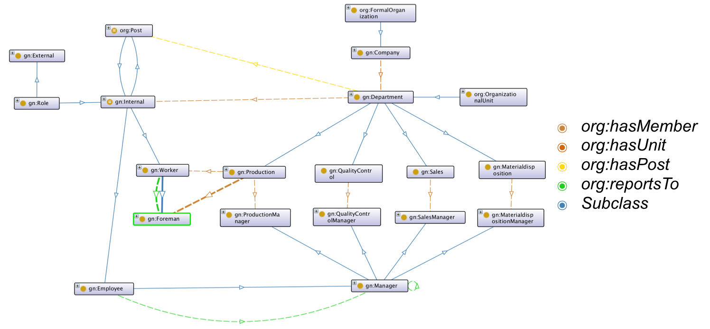
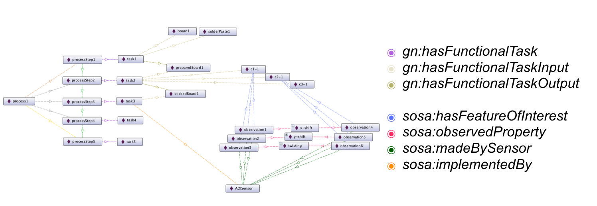
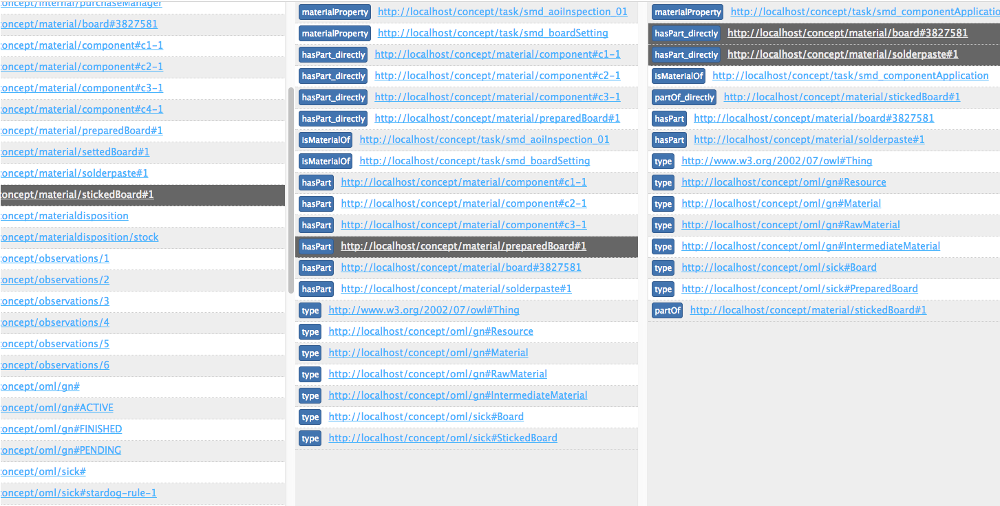

# Ontology-based Customization and Visualization of Information Flow control in an Industry 4.0 scenario

![https://pixabay.com/de/industrie-industrie-4-0-2496192/][hero]

## Motivation
In the context of digitalization, networking of manufacturing companies is also progressing. The developments in this domain are summarized under the term **Industry 4.0**, which covers not only the networking of human and machine, but also of factories and production facilities [[1]](#ref_1). Using sensors and sensor networks, production data is captured and the resulting high volume of information is processed using new technologies. Autonomous agents trigger the need for technologies, which serve *dynamic* and *machine-processable* documents. Documents of this type are served by the latest developments of *Semantic Web* [[2]](#ref_2).    

One of those technologies is the *Web Ontology Language* (OWL) [[3]](#ref_3). It is not only suitable for developing knowledge models but also meets the above mentioned requirements. OWL serves for *classification*, *consistency-checking* and *knowledge-inference* and benefits through its capability to share common concepts through shared *vocabularies*:  
Interesting vocabularies in the context of industrial information models are the *Semantic Sensor Network Ontology* (SSN) [[4]](#ref_4), the *Organizational Ontology* (ORG) [[5]](#ref_5) and the *Simple part-whole relations* (partOf) [[6]](#ref_6).  

There is a need to enrich data by its *semantic* purpose, in order to allow autonomous agents to respond to events [[7]](#ref_7). The idea follows the target of keeping the resulting data of future production plants altogether in one shared data model, breaking up with the diversity of current information systems like MES, ERP and SCM. Following this direction, there's also a need for new concepts of how to control this resulting *information flow*.     

While classic access control simply restricts who should be granted access to which information, *Information Flow control* extends this question to a more flexible model [[8]](#ref_8). Information Flow control enhances it by adding a temporal and location-based context to the request of a datapoint. Masoumzadeh et. al. presents a smart way of how to implement an ontology-based method of Information Flow control [[9]](#ref_9). Their proposal follows the idea of a N-ary design pattern [[10]](#ref_10) and serves as a starting point for an own implementation.  

**Research** has shown that while there are several proposals of how to structure and design an ontology-based datamodel for an Industry 4.0 scenario, there wasn't any comparable ontology at the time of publishing. This gives us the possibility to present a modularized way of an industrial and ontology-based datamodel.  

## Ontology Design

Part of this work was to create two ontologies, which served for exploring and analyzing the possiblities and boundaries of an ontology-based datamodel for an Industry 4.0 scenario. These possibilities should be explored in ways of how to capture the structure of *processes* and *resources* of a manufacturing-driven company. Resources are further divided into personnel structures and equipment, which are used by or through processes in order to produce products.  

### Top-Level-Ontology

The first part of work was contributed to create a *Top-Level-Ontology*. This ontology glues together exisiting concepts of established vocuabularies, like SSN, ORG and partOf. It not only uses those concepts to build a robust top-level starting point, but extends them by enhancing the ontology with core-concepts of manufacturing-related terms. The target was to build a generic datamodel, which should be suitable to interact as an intermediate layer between those well-defined concepts and a company-specific ontology.  

*Snapshot of the Top-Level Ontology, showing the personnel-view*

### Base-Ontology

The *Base-Ontology* was build with the aim to simulate a concrete manufacturing company. A usecase was constructed by a small, but helpful dataset by SICK AG [[11]](#ref_11). Using this dataset a usecase, which captured the whole manufacturing process from low-level sensor-layer till high-level information abstraction, could be constructed. Using SWRL [[12]](#ref_12) an automated and rule-based annotation could be implemented, which reactes to data-driven events by creating custom information objects for process-responsible persons.  

*Snapshot of the Base Ontology, showing the process-view*

## Architecture & Implementation

  
*Implemented architecture showing the main three components implemented*

Part of this work was to evaluate performance of developed ontologies and fulfilment of set usecases. This was done by implementing three major components, which simulated the execution of real-time reasoning in an event-stream based scenario.   
Therefore a java-based core component, a triple-based datastorage and a nodejs-based client-app were implemented and developed.   

1. The java-based core component fulfills two functionalities: First of all, it processes an incoming data-stream by adding it to one of two implemented datastorages. The second functionality is implemented through two reasoner: the Openllet OWL 2 DL Reasoner [[13]](#ref_13), which is the opensource-continuation of the reasoner Pellet [[14]](#ref_14) and the Generic Rule Reasoner, which is part of the Apache Jena Framework [[15]](#ref_15).  

2. Two datastorages were evaluated: Apache Fuseki, which is part of the Apache Jena Framework and mainly serves RDF-triples through an HTTP-interface and Stardog [[16]](#ref_16), which is an triplestore with not only OWL 2 DL reasoning capabilities but also with a rule-based reasoning engine (over different OWL Profiles).

3. For an easier exploration of application data, a nodejs-based web application was designed and implemented. In its first implementation, it roughly serves as a column-based triple explorer.    

*Snapshot of the client-app, which serves to explore the data in an easy way*

**Note:** Part of the work included building a datagenerator, which aims the target to instanciate ontologies by the given usecase. As the focus of this work was not set around this datagenerator, it's solution is neither sophisticated nor complete. For a better approach, have a look at Raynaud et. al.: *A generic and high-performance RDF instance generator* [[17]](#ref_17), who provides the best solution for this problem at the moment.   

## How to use

This project provides the written [thesis](01_thesis/BA-Thesis.Oliver-Koenig.v1.1.pdf), the presentation [slides](02_slides/BA-Thesis_t2_v1.0.pdf) as well as the source [code](code/).  
Source code is divided into several parts:

1. [*core*](#core), which contains the EventDataProcessor and the EventProcessor
2. [*app*](#app), which contains the Client App 
3. [*Stardog*](#Stardog)
4. [*Fuseki*](#Fuseki)

as well as several [*ontologies*](#ontologies) split over a few folders.

### Core  

Simply open the folder `core` with your most beloved IDE and you will find two packages:

> 1. EventDataProcessor, which serves to *produce* demo-data. The settings can be found at `Main.java`, where you can adjust the numbers of instances to instanciate. `IRIHandler.Input` offers the option to toggle the output folder of the produced data. 

> 2. EventProcessor, which serves as an intermediate layer between the produced files and the datastorage. Interfaces for both *Apache Fuseki* and *Stardog* are implemented and can be used through the methods `useStardog()` or `useFuseki()`. Reasoning is also supported (as described above) and can be activated by `enableInterference()`. **Note**: EventProcessor also uses `IRIHandler.Input` as input folder. 

### App

The client app was implemented with Node.js and can be found within the `app` folder. 

> * Simply install Node.Js, e.g with a Homebrew command `brew install node` 
> * Then, start the client app with `node bin/www` within the `app` folder. 
> * A port is opened at `3030`. 
> * The client app was implemented with interfaces supporting Apache Fuseki or Stardog (default). To change the database connected, simply open `controller/sparql.js` and set `core.mode` to either `fuseki` or `stardog`. 
> * Further settings can be observed within the specific implementation files `fusekiProcessor.js` and `stardogProcessor.js`

### Stardog

Stardog can be started by executing `./stardog-admin server start`, which is located within `stardog/bin`. 
> * A port is opened at num `5280`, which is also hardcoded within all other apps. 
> * A database was preconfigured and can be found at `stardog-data`, which is located within `stardog`. 

### Fuseki

Fuseki can be started by executing `./fuseki-server --update`. 

> * A port is opened at num `3030`, which is also used by all other apps.
> * Fuseki uses a TDB triple store, which is configured by an assembler configuration file. It is located at `fuseki/run/configuration/combined.ttl` and structures the triple graph into three subgraphs: `schema`, `data` and `inferred`, which collects all inferred axioms. This setup was chosen due to the reasoning restrictions of Apache Jena, which restricts reasoning to RDF and OWL 1 axioms. By using the EventProcessor inference engine, reasoning can be executed with integrated java reasoners (as described above) and results can be stored within the separat `inferred` graph.  

### Ontologies

All major ontologies are located within `_ontology`. 

> * The top-level ontology is located at `_ontology/schema/ManufacturingOntologyLanguage.gn.ttl` and serves as the intermediate layer between established concepts (SOSA/SSN/partOf) and a more specific company ontology
> * The base ontology is located at `_ontology/schema/ManufacturingOntologyLanguage.sick.ttl` and serves as an example of a specific company ontology
> * The concept for some SWRL rules can be found at `_rules`. They are written in pseudo-code and some of them where translated into an extra ontology
> * The extra ontology containing only SWRL rules can be found at `schema/ManufacturingOntologyLanguage.sick.swrl.ttl`
> * All ontologies use the import declarative to resolve depencenies 
 

## Results, Evaluation and further Objectives 

... are found within the written [thesis](01_thesis/BA-Thesis.Oliver-Koenig.v1.1.pdf).  

## TagCloud

![][tagcloud]

## License 

Information of how to use this document to be found at: [License](LICENSE).

## Contact ##

* Creator: Oliver König @ okoenig@teco.edu
* Supervisor: Dipl.-Ing. Antonios (Toni) Karatzoglou @ antonios@teco.edu
* Co-Supervisor: Andrei Miclaus @ miclaus@teco.edu

## References

[1] - P. K. der Forschungsunion Wirtschaft. Wissenschaft (Hrsg.): Bericht der Promotorengruppe Kommunikation: Im Fokus: Das Zukunftsprojekt Industrie 4.0–Handlungsempfehlungen zur Umsetzung, 2012. [https://www.bmbf.de/pub_hts/kommunikation_bericht_2012-1.pdf](https://www.bmbf.de/pub_hts/kommunikation_bericht_2012-1.pdf)

[2] - W3C. Description of W3C Technology Stack Illustration. [https://www.w3.org/Consortium/techstack-desc.html](https://www.w3.org/Consortium/techstack-desc.html), 2010. Accessed: 2017- 09-14.

[3] - Web presentation of *W3C's specification of Web Ontology Language*: [https://www.w3.org/OWL/](https://www.w3.org/OWL/)

[4] - Semantic Sensor Network Ontology: [https://www.w3.org/TR/vocab-ssn/](https://www.w3.org/TR/vocab-ssn/)

[5] - The Organization Ontology: [https://www.w3.org/TR/vocab-org/](https://www.w3.org/TR/vocab-org/)

[6] - Simple part-whole relations in OWL Ontologies: [https://www.w3.org/2001/sw/BestPractices/OEP/SimplePartWhole/](https://www.w3.org/2001/sw/BestPractices/OEP/SimplePartWhole/)

[7] - A. Blumauer und T. Pellegrini. Semantic Web und semantische Technologien: Zentrale Begriffe und Unterscheidungen. Semantic Web, 2006, S. 9–25.

[8] - K. Lehmann. Modelle und Techniken für eine effiziente und lückenlose Zugriffskontrolle in Java-basierten betrieblichen Anwendungen. Disssertation, Technical University Munich, Germany, 2007.

[9] - A. Masoumzadeh und J. Joshi. Osnac: An ontology-based access control model for social networking systems. In Social Computing (Social- Com), 2010 IEEE Second International Conference on. IEEE, 2010, S. 751–759.

[10] - W3C. Defining N-ary Relations on the Semantic Web. [https://www.w3.org/TR/swbp-n-aryRelations/](https://www.w3.org/TR/swbp-n-aryRelations/), 2006. Accessed: 2017-10-29.

[11] - SICK AG: [https://www.sick.com/de/de/](https://www.sick.com/de/de/)

[12] - SWRL: A Semantic Web Rule Language  
Combining OWL and RuleML: [https://www.w3.org/Submission/SWRL/](https://www.w3.org/Submission/SWRL/)

[13] - Openllet: An Open Source OWL DL reasoner for Java: [https://github.com/Galigator/openllet](https://github.com/Galigator/openllet)

[14] - Pellet: An Open Source OWL DL reasoner for Java: [https://github.com/stardog-union/pellet](https://github.com/stardog-union/pellet)

[15] - Apache Jena: [https://jena.apache.org/](https://jena.apache.org/)

[16] - Stardog: The Knowledge Graph Platform for the Enterprise: [https://www.stardog.com/](https://www.stardog.com/)

[17] - Raynaud, Tanguy, Samir Amir, and Rafiqul Haque. "A generic and high-performance RDF instance generator." International Journal of Web Engineering and Technology 11.2 (2016): 133-152.

[hero]: assets/industry-2496192_1920.jpg
[tagcloud]: assets/Tagcloud.png